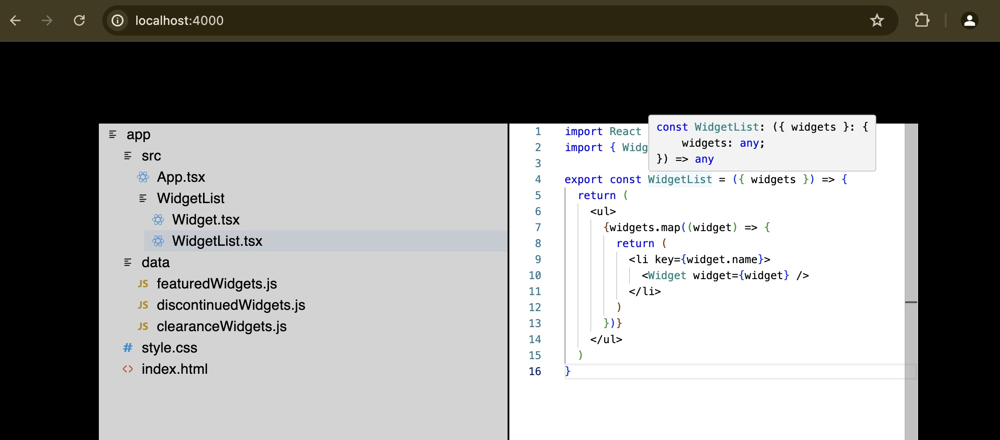
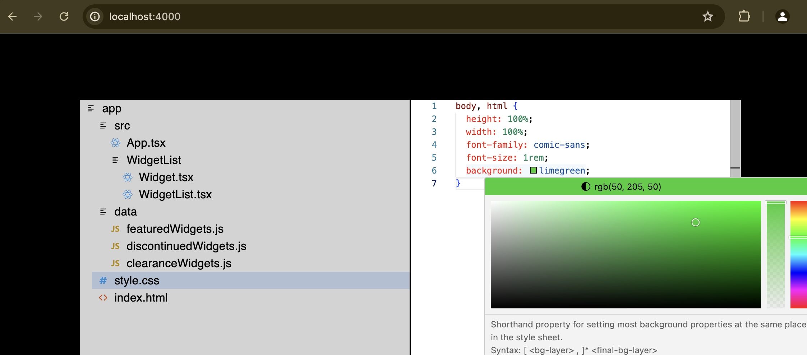

# react web IDE

To install dependencies use:

```
pnpm install
```

To manually start development server:

```
pnpm dev

```

Next, open your browser and visit http://localhost:5173/. The default React project will be running on port 5173.

> Note that is Vite started the app itself the port would be 4000 instead ( http://localhost:4000/ )

## Tests

```
pnpm test:watch

```

or

```
pnpm test:watch <path-to-file>

```





# About

react-web-IDE is a web based IDE environment. Just like vscode

## Main Goals

1. Show the files in a nested structure, with separate sections for each folder and file.
2. Make sure the application can handle file structures of any complexity
3. Arrange the file tree in a specific order:
   3.a Folders should be displayed before files
   3.b All items should be sorted alphabetically, regardless of uppercase or lowercase letters
4. Any changes you make to file contents must persist for the duration of the session and save automatically for the session
5. Most functionality is tested

## Libraries used:

- monaco-editor (Code Editor)
- @mui/material (Material UI)

## Tooling:

- **Vite:** Frontend build tool that serves your source files over native ES modules, with rich features and fast _Hot Module Replacement (HMR)_. _Vite_ is fast because it doesn't bundle your code at all. It leverages the native support for ESM (ECMAScript Modules) of modern browsers. It sends your file directly without being bundled
- **@vitejs/plugin-react-swc:** This speeds up your Vite dev server with [SWC](https://swc.rs/) _(~20x faster than Babel)_
- **ESLint and Prettier:** For linting and pretty-printing JavaScript code respectively
- **Jest and @testing-library/react:** for unit testing
- **Vitest:** Modern testing framework
- **MSW:** Mock Service Worker (MSW) is an API mocking library for browser and Node.js. See [stop mocking fetch](https://kentcdodds.com/blog/stop-mocking-fetch). With MSW, you can intercept outgoing requests, observe them, and respond to them using mocked responses. MSW can integrate throughout your entire stack, allowing you to reuse and customize network behavior on demand. Imagine using the same API mocks during development, integration and end-to-end testing, and then in your Storybook or during a live demo.
